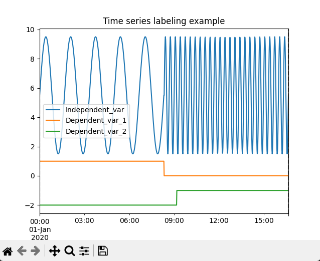

# Time series labeling tool
## Description

This is a very simple tool to assist in labeling time series data. 
It was created because many labeling tools for time series assume that every time series gets a single label.
For my project I am running more of a time series translation problem where I want to label every timestep with multivariate options.

This tool is designed to be used with matplotlib and pandas.
- All you need to do is create a pandas dataframe with a time index and columns to view & label.
- Then create a dictionary where the keys are the labels and the values are the columns to update.
- Matplotlib will plot the graph as usual, but now when you left-click or rightclick you set bounds for a label update.
- Then you can push a key to update the data and redraw the data.
- Optionally you can use left and right arrow keys to set that as the data start or end respectively (rest will be deleted).


## Installation

The easiest way to use this tool is to incorporate the `MatplotlibAssist` class into your own code.
* If you are using PyCharm, turn of the "Show plots in tool window" setting in the matplotlib preferences.
found here `PyCharm > Settings > Tools > Python Plots`

## Example

To run this example, clone this repo and run the following command from the root directory of the repo:
```bash
pip install -r requirements.txt
python main.py
```

The labeling happens in the matplotlib window. When you click left or right, the data is updated and the plot is redrawn.
When you close the plot, the data can be saved to a csv file if you add an `exit_function`.



Simple example code

~~~python
import math
import pandas as pd
import matplotlib.pyplot as plt
from timeseries_labeler import MatplotlibAssist

# Create example data
date_range = pd.date_range(start="2020-01-01", periods=1000, freq="1min")
example_df = pd.DataFrame({
    "Independent_var":  (
                [math.sin(x / (2 * math.pi)) * 4 + 5.5 for x in range(500)] +
                [math.sin(x / (10 * math.pi)) * 4 + 5.5 for x in range(500, 1000)]), 
    "Dependent_var_1": [int(x < 500) for x in range(1000)],
    "Dependent_var_2": [int(x > 550) - 2 for x in range(1000)],
    "time_stamp": date_range}).set_index("time_stamp")

# Create update dict, where the keys are the labels and the values are the columns to update
update_dict = {
    "1": {"Dependent_var_1": 1.0},
    "0": {"Dependent_var_2": -2.0, "Dependent_var_1": 0.0},  # Can update multiple columns
    "2": {"Dependent_var_2": -1.0},
}

# Create handler instance and plot
fig = example_df.plot(title=f"Time series labeling example")
handler_instance = MatplotlibAssist(
    ax=fig,
    df=example_df,
    update_dict=update_dict,
    exit_function=lambda df: df.to_csv("labeled_data.csv")  # Save the data to a csv file
)

# Connect to the figure
handler_instance.connect()
plt.show(block=True)
~~~